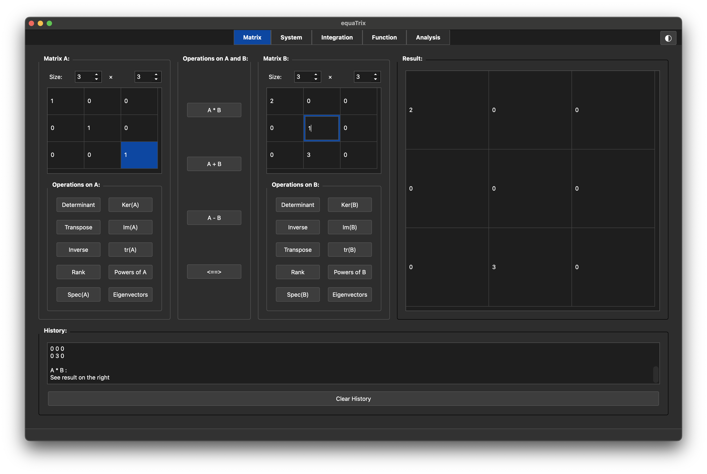
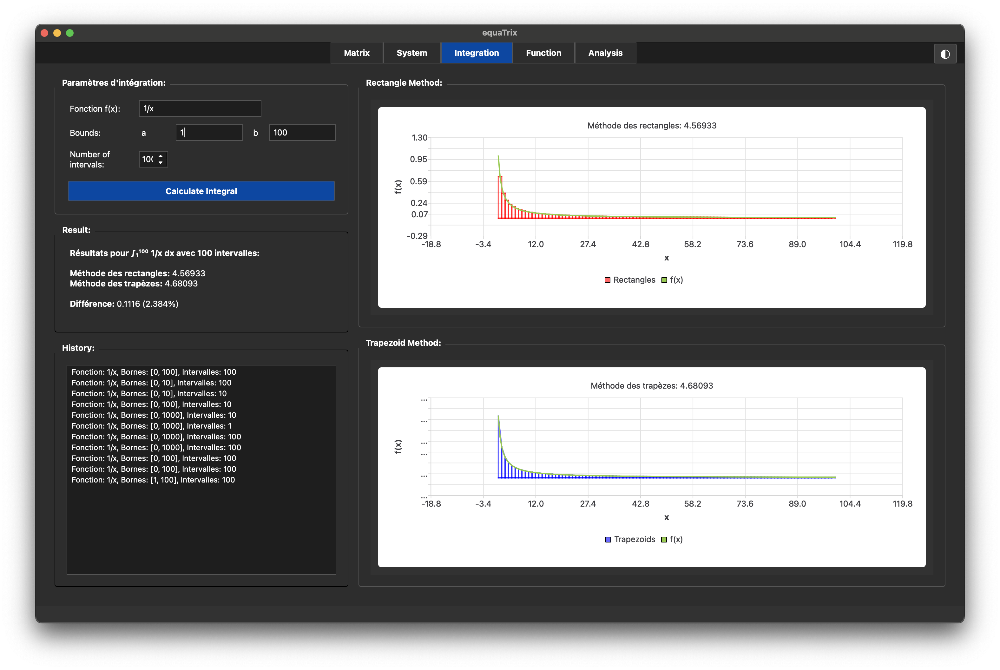
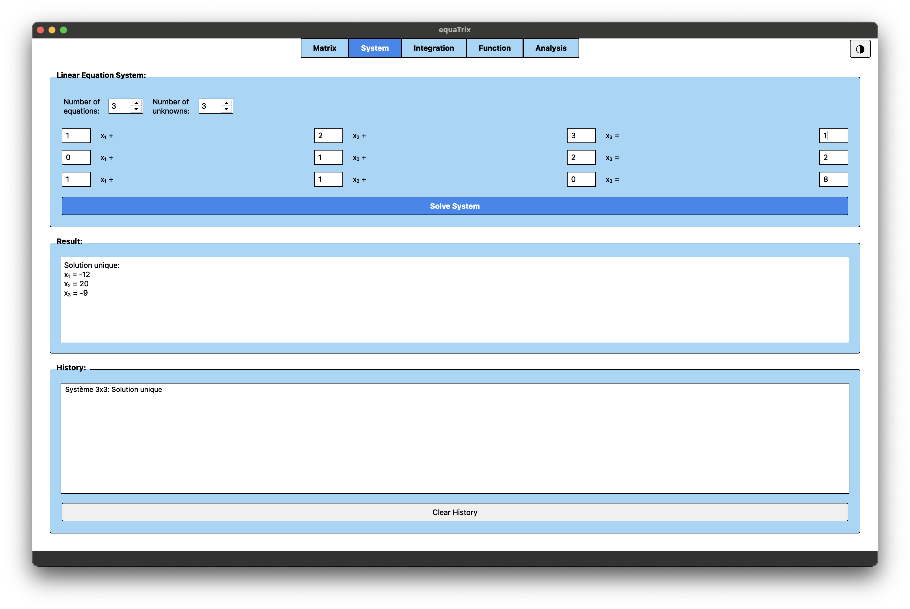

# EquaTrix

A comprehensive mathematical application for matrix operations, linear system solving, numerical integration, and function analysis.

## Screenshots

### Matrix Operations

*Matrix tab interface showing matrix operations, calculations, and results*

### Numerical Integration

*Integration tab with graphical visualization of rectangle and trapezoid methods*

### System Solver

*System tab for solving linear equation systems with step-by-step solutions*

## Project Information

### Description
EquaTrix is a cross-platform mathematical application that enables users to manipulate matrices, solve linear equation systems, integrate functions, and analyze mathematical functions. Built with C++ and Qt, it provides a modern graphical interface for complex mathematical computations.

## Project Architecture

The project is organized into two main components:

- A set of C++ classes for mathematical computations (`Matrix`, `System`, `Function`, `Integral`)
- A graphical user interface using the Qt framework to interact with these classes

### File Structure

```
equaTrix/
├── src/               # Source code
│   ├── backend/       # Mathematical computations
│   │   ├── Matrix.h/cpp   # Class for matrix operations
│   │   ├── System.h/cpp   # Class for solving equation systems
│   │   ├── Function.h/cpp # Class for evaluating mathematical functions
│   │   └── Integral.h/cpp # Class for calculating integrals
│   ├── qt/            # Qt graphical interface
│   │   ├── mainQt.cpp     # Qt program entry point
│   │   ├── mainwindow.h/cpp # Main window interface
│   │   ├── mainwindow.ui    # Qt UI design file
│   │   └── resources.qrc    # Qt resources (icons, etc.)
│   └── antlr4/        # Files generated by ANTLR
│       ├── CalcLexer.cpp/h
│       ├── CalcParser.cpp/h
│       ├── CalcVisitor.h
│       ├── CalcBaseVisitor.h
│       └── CalcListener.h
│   
├── build/             # Compilation directory (generated)
├── bin/               # Compiled executables (generated)
├── obj/               # Intermediate object files (generated)
├── public/            # Screenshots and documentation assets
├── CMakeLists.txt     # CMake configuration for compilation
└── makefile           # Makefile for terminal version
```

## Qt Framework in EquaTrix

### Introduction to Qt

Qt is a cross-platform C++ framework that enables the creation of high-performance, modern graphical interfaces. Here are the key concepts used in our application:

1. **Widgets**: User interface elements (buttons, text fields, etc.)
2. **Layouts**: Arrangement of widgets in the interface
3. **Signals and Slots**: Event mechanism to connect the interface to functionalities
4. **Meta-Object Compiler (MOC)**: System that enriches C++ with features like signals/slots

### Class Integration in Qt

#### Matrix Class in Qt Interface

The `Matrix` class is integrated into the Matrix tab of the graphical interface:

- Matrices are visually represented by editable tables (`QTableWidget`)
- Matrix operations (addition, multiplication, etc.) are performed by directly calling `Matrix` class methods
- Integration process:
  1. User enters values in the interface
  2. Values are extracted and converted to `Matrix` objects
  3. Operations are performed on these objects
  4. Results are converted back for display in the interface

#### System Class in Qt Interface

The `System` class is integrated into the System tab of the graphical interface:

- Users can enter an augmented matrix representing a linear equation system
- The application uses `SystemSolver::analyzeSystem` to determine the solution type
- Solutions are displayed according to their type (unique, infinite, none)

## Compilation and Execution

### Prerequisites

- CMake 3.16 or higher
- C++17 compatible compiler
- Qt 5 or Qt 6 with Widgets module

#### Installing Prerequisites

##### On macOS
```bash
# Installation via Homebrew
brew install cmake
brew install qt@6

# Add Qt to PATH (add to ~/.zshrc or ~/.bash_profile)
echo 'export PATH="/opt/homebrew/opt/qt@6/bin:$PATH"' >> ~/.zshrc
source ~/.zshrc
```

##### On Linux (Ubuntu/Debian)
```bash
# Install basic tools
sudo apt update
sudo apt install build-essential cmake

# Install Qt6
sudo apt install qt6-base-dev qt6-base-private-dev
sudo apt install qt6-tools-dev qt6-tools-private-dev
sudo apt install qt6-declarative-dev qt6-declarative-private-dev

# Install additional Qt modules
sudo apt install libqt6widgets6 qt6-tools-dev-tools
```

##### On Linux (Fedora)
```bash
# Install basic tools
sudo dnf install gcc-c++ cmake

# Install Qt6
sudo dnf install qt6-qtbase-devel
sudo dnf install qt6-qttools-devel
sudo dnf install qt6-qtdeclarative-devel

# Install additional Qt modules
sudo dnf install qt6-qtwidgets qt6-qttools
```

##### Installation Verification
To verify that Qt is properly installed:
```bash
qmake6 --version
```

#### With CMake (Recommended for Qt)
Execute the build script:
``` 
./build.sh 
```

### Platform Compatibility

The application is compatible with:

- macOS
- Linux

Thanks to the use of Qt and CMake, compilation and execution follow the same process on all platforms, with only slight differences in execution paths.

## Features

### Matrix Tab

- Creation and manipulation of variable-size matrices
- Operations: addition, subtraction, multiplication, comparison
- Property calculations: determinant, transpose, inverse, rank
- Advanced operations: kernel, image, trace, powers, eigenvalues, eigenvectors

### System Tab

- Solving linear equation systems
- Detection of solution type (unique, infinite, none)
- Solution display and calculation history

### Integration Tab

- Numerical integration of functions
- Multiple methods available (rectangles, trapezoids)
- Graphical visualization of integration methods
- Interactive plotting with customizable intervals

### Function Tab

- Mathematical function analysis
- Derivative calculation and root finding
- Function behavior analysis
- Export functionality for analysis results

### Analysis Tab

- Data visualization and analysis
- Support for CSV and JSON file formats
- Interactive chart generation
- Statistical analysis tools

## Technical Features

- **Dark/Light Mode**: Toggle between themes for better user experience
- **Real-time Calculations**: Instant computation and result display
- **History Tracking**: Keep track of all performed operations
- **Export Capabilities**: Save results and analyses
- **Responsive UI**: Adaptive interface that works on different screen sizes

## Getting Started

1. Clone the repository
2. Install the prerequisites for your platform
3. Run the build script: `./build.sh`
4. Execute the application from the `bin/` directory

## Contributing

This project is built with modern C++ practices and Qt framework. Contributions are welcome for:

- New mathematical operations
- UI/UX improvements
- Platform-specific optimizations
- Documentation enhancements

## License

This project is part of an academic assignment and is intended for educational purposes.